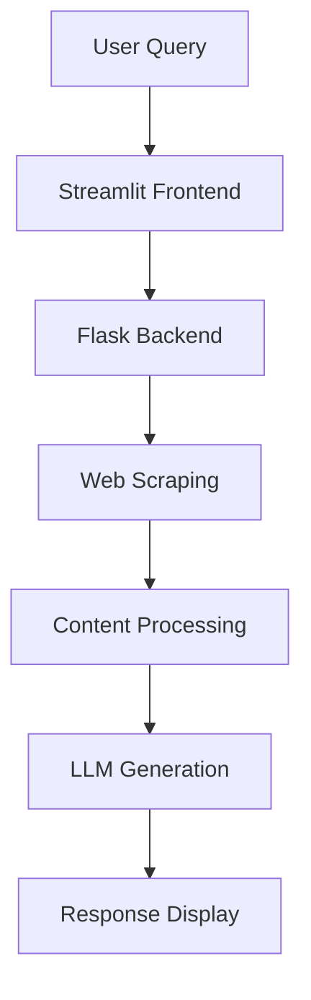

# LLM-Based RAG System

## Overview

This project implements a Retrieval-Augmented Generation (RAG) system using Large Language Models (LLMs). The system features:
- Streamlit frontend for user interaction
- Flask backend for processing
- Web scraping capabilities
- LLM integration for answer generation

## Screenshots

### User Interface
| Empty State | With Results |
|-------------|--------------|
|  |  |

### Terminal Views
| Streamlit Server | Flask Backend |
|------------------|---------------|
|  |  |

## System Architecture


## Installation Guide
### 1. **Prerequisites**
- Python 3.8+

### 2. **Setup Environment**

```bash
# Clone repository
git clone https://github.com/abhishek751982/llm_search_template
cd llm_search_template

# Create virtual environment
python -m venv venv
source venv/bin/activate  # Windows: venv\Scripts\activate

# Install dependencies
pip install -r requirements.txt
```
### 3. **Configuration**
- Create .env file:
```bash
OPENAI_API_KEY=your_api_key_here
SEARCH_API_KEY=your_search_key
```
4. **Running the System**
```bash
# Terminal 1 - Start Flask backend
cd flask_app
python app.py

# Terminal 2 - Start Streamlit frontend
cd streamlit_app
streamlit run app.py
```
## Usage Instructions
- Access http://localhost:8501 in your browser

- Enter your query in the search box

- Click "Search" button

- View generated results
